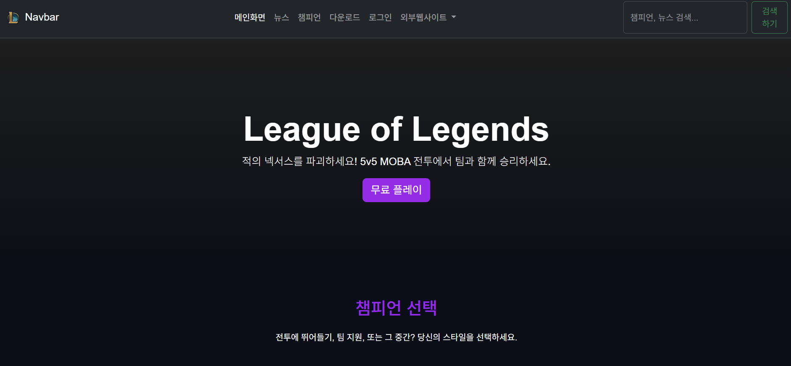
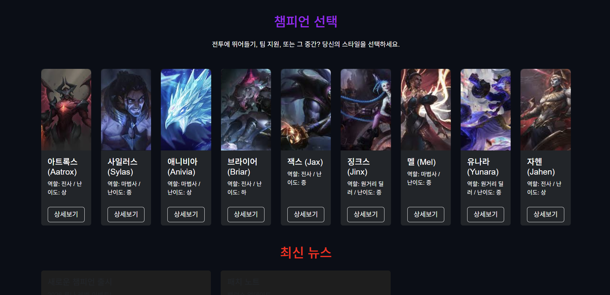
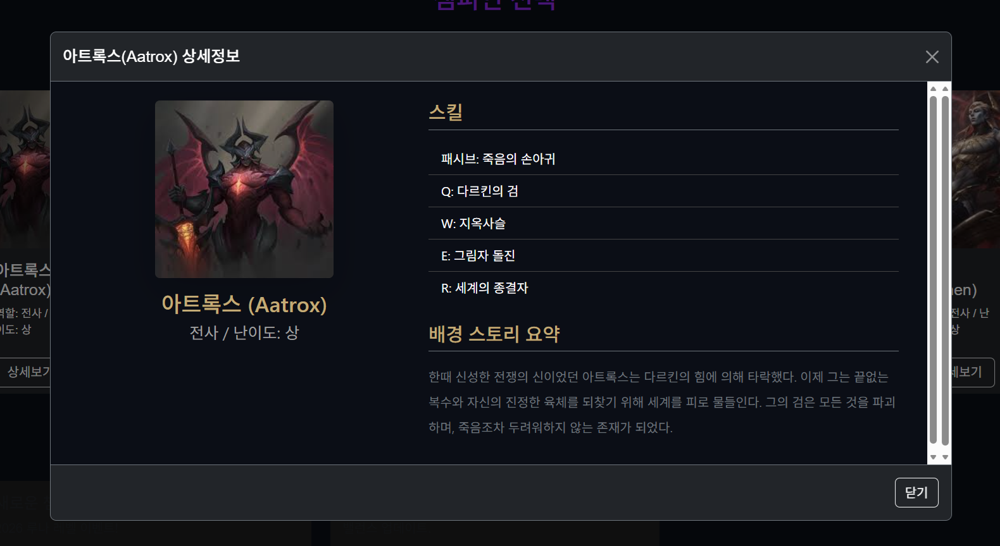
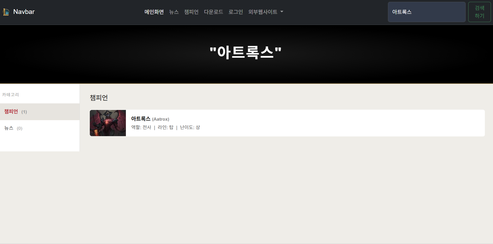

# Java Web Programming
학번: 20231404 이름: 김보미

---

# 📚 주차별 학습 내용

---

## 📌 Week 1 - OT (오리엔테이션)

### 🛠️ 이번 주 한 것들
- 수업 진행 방식 및 평가 기준 안내
- 수업의 전체 흐름 이해

---

## 📌 Week 2 - 개발 환경 구축 및 Quarkus 기초

### 🛠️ 이번 주 한 것들

**1. 개발 환경 세팅**
- VS Code, JDK 등 개발 환경을 설치하고 세팅했습니다.
- Quarkus 프레임워크가 무엇인지, 웹 서버가 어떻게 실행되는지 (localhost:8080) 이해했습니다.

**2. 첫 번째 Quarkus 프로젝트 실행**
- `./mvnw quarkus:dev` 명령어로 서버를 처음 실행해봤습니다.
- `index.html` 을 생성하고 Hello Quarkus 출력을 확인했습니다.

### ❗ 발생한 오류 & 해결 과정

**1. 서버 실행 오류**
- 원인: 초기 설정 문제
- 해결: 설정 확인 후 해결

**2. Git 사용자 정보 오류**
- 원인: Git 사용자 정보 미설정
- 해결: `git config` 명령어로 사용자 정보 등록

### 💭 느낀 점

> 로컬 서버를 통해 웹이 실행되는 구조를 처음 이해하게 되었다.

---

## 📌 Week 3 - LOL 메인 페이지 구현

### 🛠️ 이번 주 한 것들

**1. HTML 기초 및 Bootstrap 사용**
- HTML 기본 구조 (div, h1, p 등)를 배우고 Bootstrap을 처음 사용해봤습니다.
- 웹 페이지 레이아웃 개념을 이해했습니다.

**2. LOL 메인 화면 구현**
- LOL 테마의 메인 화면 UI를 구현했습니다.
- 상단 네비게이션 바를 구성했습니다.

### ❗ 발생한 오류 & 해결 과정

**1. 이미지 출력 오류**
- 원인: 이미지 파일 경로가 잘못 설정됨
- 해결: 경로 수정 후 정상 출력 확인

### 💭 느낀 점

> 단순 흰 페이지에서 실제 서비스 형태처럼 바뀌는 과정이 재미있었다.

---

## 📌 Week 4 - 네비게이션 바 및 카드 UI 확장

### 🛠️ 이번 주 한 것들

**1. 네비게이션 바 구현**
- Bootstrap 네비게이션 바 구조를 이해하고 반응형 레이아웃을 구성했습니다.
- 상단 네비바를 수정하고 개선했습니다.

**2. 챔피언 카드 추가**
- 챔피언 카드 UI를 추가하고 전체적인 디자인을 개선했습니다.

### ❗ 발생한 오류 & 해결 과정

**1. 404 오류**
- 원인: 파일 경로 설정 오류
- 해결: 경로 수정 후 해결

**2. 카드 정렬 문제**
- 원인: row / col 구조가 잘못 설정됨
- 해결: row / col 구조 수정 후 정상 정렬 확인

### 💭 느낀 점

> 조금씩 어려워 지지만 UI와 구조를 동시에 설계하는 경험을 하게 되었다.

---

## 📌 Week 5 - 모달창 및 서브 페이지 구현

### 🛠️ 이번 주 한 것들

**1. 챔피언 모달창 구현**
- Bootstrap 모달 구조를 이해하고 챔피언 클릭 시 모달창이 뜨도록 구현했습니다.

**2. 다운로드 페이지 구현**
- `download.html` 서브 페이지를 새로 만들었습니다.
- iframe을 활용해서 페이지 안에 다른 페이지를 연결했습니다.

### ❗ 발생한 오류 & 해결 과정

**1. 모달 내부 페이지 오류**
- 원인: iframe 내부 파일 경로가 잘못됨
- 해결: 경로 수정 후 정상 출력 확인

**2. CSS 적용 문제**
- 원인: CSS 파일 연결이 누락됨
- 해결: 파일 연결 추가 후 해결

### 💭 느낀 점

> 여러 페이지가 연결되며 웹 서비스 구조를 이해하게 되었으며 페이지간 연결이 신기하였다.

---

## 📌 Week 6 - JavaScript 기초

### 🛠️ 이번 주 한 것들

**1. JavaScript 기초 실습**
- JS의 역할(동작 담당)을 이해하고 변수 선언 방식(`var`, `let`, `const`)과 호이스팅 개념을 배웠습니다.
- `test.js` 파일을 생성하고 콘솔 출력을 확인했습니다.

**2. 이벤트 처리 구현**
- `window.onload` 이벤트를 구현했습니다.
- 버튼 클릭 시 alert가 뜨는 이벤트를 구현했습니다.

### ❗ 발생한 오류 & 해결 과정

**1. JS 실행 안됨**
- 원인: script 태그 위치가 잘못된 곳에 있었음
- 해결: script 위치를 body 하단으로 이동 후 정상 실행 확인

**2. 변수 오류**
- 원인: 스코프 개념 미이해로 인한 변수 접근 오류
- 해결: 스코프 개념 이해 후 해결

### 💭 느낀 점

> 생각보다 이해하는데 시간이 들었지만, JS를 통해 웹이 "동작"하는 구조를 이해하게 되었다.

---

## 📌 Week 7 - 검색 기능 구현 및 JS 활용

### 🛠️ 이번 주 한 것들

**1. 검색 기능 구현**
- DOM 구조와 이벤트 리스너(`addEventListener`)를 활용해 검색 기능을 구현했습니다.
- 챔피언/뉴스 데이터를 배열로 구성하고 `filter()`로 키워드 검색 로직을 만들었습니다.

**2. 검색 결과 UI 구현**
- 검색 결과를 화면에 출력하고 카테고리(챔피언 / 뉴스) 필터 기능도 추가했습니다.
- `search.js` 파일을 별도로 생성해서 연결했습니다.

### ❗ 발생한 오류 & 해결 과정

**1. 검색 결과 미출력**
- 원인: filter 조건이 잘못 설정됨
- 해결: 조건 수정 후 정상 출력 확인

**2. 화면 전환 문제**
- 원인: display 속성 제어가 누락됨
- 해결: display 속성 추가 후 해결

### 💭 느낀 점

> 데이터 처리 → 화면 출력까지의 전체 흐름을 경험했다.
> 실제 웹 서비스와 유사한 구조를 구현할 수 있었다.

---

# 중간고사 전까지 진행한 프로젝트 회고

### 성장한 점
- 웹의 기본 구조 (HTML, CSS, JS)를 전체적으로 이해하게 되었다.
- 단순 구현이 아닌 문제 해결 능력이 향상되었다.
- UI + 기능 + 데이터 흐름을 모두 경험하였다.

### 아쉬운 점
- 코드 구조를 더 깔끔하게 정리하지 못한 점
- 디자인 완성도가 부족한 부분

### 작업물
#### 메인 화면

#### 검색화면

---

## 📌 Week 9 - JavaScript 기능 확장 및 MySQL 데이터베이스 연동

### 🛠️ 이번 주 한 것들

**1. 다크모드 / 라이트모드 구현**
- 버튼 클릭 시 테마가 전환되는 다크모드 / 라이트모드 토글 기능을 구현했습니다.
- CSS + JS를 함께 활용해서 구현했습니다.

**2. MySQL 데이터베이스 연동**
- MySQL을 설치하고 `lol` 데이터베이스를 생성했습니다.
- `application.properties` 에 DB 연결 설정을 추가했습니다.
- `Champion` 엔티티 클래스를 생성하면 테이블이 자동으로 만들어지는 것을 확인했습니다.

**3. API 구현 및 데이터 확인**
- `ChampionResource` 로 데이터 조회/추가 API를 구현했습니다.
- `DataSeeder` 로 초기 챔피언 데이터를 자동으로 삽입했습니다.
- `/champions` API를 호출해서 JSON 데이터를 확인했습니다.

### ❗ 발생한 오류 & 해결 과정

**1. MySQL 비밀번호 분실**
- 원인: 비밀번호를 잊어버림
- 해결: 초기화 후 재설치로 해결

**2. MySQL 서버 실행 오류**
- 원인: 설정 및 경로 문제
- 해결: 설정 수정 후 정상 실행 확인

**3. DB 연결 실패**
- 원인: `application.properties` 설정값 오류
- 해결: 설정 수정 후 연결 성공

**4. 테이블 미생성 문제**
- 원인: 서버를 재시작하지 않음
- 해결: 서버 재시작 후 테이블 자동 생성 확인

**5. 데이터 삽입 안됨**
- 원인: DataSeeder 구조 문제
- 해결: 코드 구조 수정 후 정상 삽입 확인

### 💭 느낀 점

> 프론트엔드(JS)와 백엔드(Java + DB)가 연결되는 구조를 처음 이해하게 되었다.
> 데이터를 저장하고 불러오는 흐름을 경험할 수 있었다.

---

## 📌 Week 10-11 - 로그인과 로그아웃

### 🛠️ 이번 주 한 것들

**1. 패키지 구조 정리**
- 기존 파일들을 도메인별 폴더로 재구성했습니다.
- `champion / common / login` 폴더로 나누고 서버 재시작으로 확인했습니다.

**2. 사용자 테이블 & 초기 데이터 생성**
- `User.java` 작성 → DB에 users 테이블이 자동으로 생성되었습니다.
- `DataSeeder.java` 에 guest 계정(guest / 123123)을 추가했습니다.
- Dev UI에서 users 테이블에 데이터가 들어간 것을 확인했습니다.

**3. 세션 설정**
- `SessionConfig.java` 를 작성해서 세션 기능을 활성화했습니다.
- HttpOnly 쿠키 설정을 추가해 JS로 세션 쿠키를 탈취할 수 없도록 했습니다.

**4. 로그인 / 로그아웃 기능 구현**
- `login.html` 로그인 폼 페이지를 작성했습니다.
- `AuthResource.java` 에 아래 엔드포인트들을 구현했습니다.

| 엔드포인트 | 방식 | 기능 |
|-----------|------|------|
| `/login` | GET | 로그인 페이지 반환 |
| `/login_check` | POST | DB 조회 후 인증 처리 및 세션 저장 |
| `/after_login` | GET | 세션 체크 후 페이지 반환 |
| `/logout` | GET | 세션 삭제 후 메인 이동 |

- 로그인 성공 시 세션에 사용자 정보 저장, 로그아웃 시 세션 전체 삭제
- 로그인 없이 `/after_login` 직접 접근 시 로그인 페이지로 강제 이동 (Forced Browsing 차단)

**5. 네비바 경로 통일**
- 페이지마다 경로가 달라 생기는 404 문제를 해결하기 위해 모든 링크를 절대 경로(`/`)로 통일했습니다.

### ❗ 발생한 오류 & 해결 과정

**1. guest 계정 데이터가 DB에 안 들어감**
- 원인: `DataSeeder.java` 구조 문제로 User 코드까지 실행이 안 됨
- 해결: `if (Champion.count() == 0)` 블록 구조로 수정해서 두 데이터가 독립적으로 삽입되도록 변경

**2. 다운로드 페이지 → 로그인 이동 시 404 오류**
- 원인: 네비바 링크가 상대 경로로 되어 있어 페이지마다 경로가 달라짐
- 해결: 모든 네비바 링크를 `/login` 처럼 절대 경로로 통일

**3. 챔피언 상세보기 모달 미작동**
- 원인: `index.html` 에서 Bootstrap JS가 주석 처리되어 있었음
- 해결: 주석 제거 후 정상 작동 확인

### 💭 느낀 점

> 데이터베이스 연동 이후 파일도 많아지고 각 파일마다 작성해야 하는 코드도 늘어나서 점점 복잡하게 느껴진다. 코드 양이 많아지니 전체적인 흐름을 파악하는 것도 쉽지 않다. 그래도 직접 구현한 로그인 기능이 실제로 동작하는 걸 보았을 때는 너무 뿌듯했다